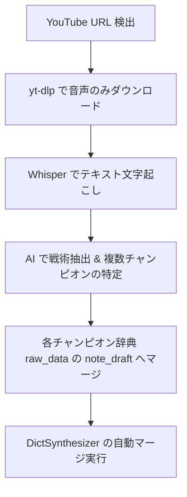

# 🎬 Ghost Tactics (YouTubeAbsorber 自律解析)

## 目的
YouTubeのLoL解説動画のURLを入力、または RSS 巡回で検出した際に、自動で動画を音声抽出し、Whisper (GPU/CPU) で書き起こしてAIで戦術を要約・抽出し、複数チャンピオンの辞典（`matchup_sentinel`）へ自動でマージする処理を一気通貫で自律制御します。

## 実行フロー



### Step 1: 動画の音声ダウンロード
`yt-dlp` を用いて、音声ファイルを軽量な形式（m4a または mp3）で一時フォルダ（`d:/my_work/02_FACTORY/_LOL/`）にダウンロードします。
- **コマンド例**:
  ```bash
  yt-dlp -x --audio-format m4a -o "d:/my_work/02_FACTORY/_LOL/%(id)s.%(ext)s" {video_url}
  ```
- **障害リカバリ**:
  `yt-dlp version is older than 90 days` エラーが発生した場合は、速やかに `pip install --upgrade yt-dlp` または `python -m pip install -U yt-dlp` を実行してアップデートしてください。

### Step 2: Whisper による文字起こし
ダウンロードした音声ファイルをローカルの Whisper (または GPU / Faster-Whisper / OpenAI API) を用いて日本語テキストに変換します。
- **実行ルール**:
  音声が長く処理に時間がかかる場合は、自動スリープ防止が機能していることを確認した上で実行します。

### Step 3: AIによる複数チャンピオンの戦術抽出
変換された生文字起こしテキストから、解説されている**すべての対象チャンピオン**を特定し、それぞれの戦術を個別に抽出します。
- **プロンプト要件**:
  動画内で2体以上のチャンピオン（例: 「ジャルヴァンとシン・ジャオの両方について語っている」）について解説されている場合、片方だけでなく、**両方のチャンピオンのIDを特定し、配列形式で出力**します。
  - **マッピングJSON**:
    ```json
    {
      "champions": ["JarvanIV", "XinZhao"],
      "analysis": {
        "JarvanIV": "### 📌 主要な戦略と役割\n...",
        "XinZhao": "### 📌 主要な戦略と役割\n..."
      }
    }
    ```

### Step 4: チャンピオン辞典への自動アペンド ＆ マージ
抽出された各チャンピオンの攻略情報を、Supabase テーブル `matchup_sentinel` の該当レコードの `raw_data` 内の `note_draft` もしくは `customFields` の末尾に自動でアペンド（追記）します。
- その後、自動巡回中の `dict_synthesizer.py` がアペンドされたごちゃごちゃの生テキスト（`## 【記事】` プレフィックス付き）を自動検知し、AI要約処理を行って1つの綺麗なMarkdownドキュメントにマージします。

---

## ⚠️ 障害対応・トラブルシューティング

### 1. 3時間タイムアウト（ゾンビタスク）時のリカバリ
エッジワーカー（`edge_worker_daemon.py`）により、3時間を超えて実行中のタスクは自動的に `failed` となり解除されます。
- 解除された場合は、ログ `00_LOGS/youtube_monitor_run.log` を確認し、Whisper またはダウンロードのどちらのプロセスがハングしているか特定します。
- 必要に応じてプロセスをキルし、該当動画の status を `pending` に差し戻して再試行します。

### 2. Gemini API 429 (クォータ制限)
無料APIキーを使用している場合、リクエスト間で **10秒以上のスリープ** を明示的に挟みます。
それでも解決しない場合、または緊急の運用時は、フロントエンドおよび API ゲートウェイ経由で有料APIバイパスキーを設定し、一時的にそちらへルーティングします。
