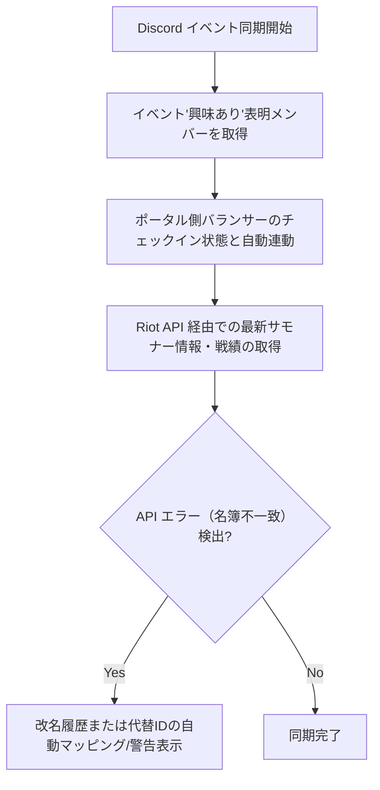

# 🤖 Riot & Discord Connector (連携接続スキル)

## 目的
LoLカスタム大会運営（KTM）において、Discord イベントの参加・興味あり状態と、ポータル上の参加者リストの自動連動、および Riot API からの戦績・サモナー名同期時に発生する同期ズレエラーを自律修復・自動マッピングします。

## 実行フロー

### Step 1: Discord 「興味あり」表明メンバーのチェックイン自動化
Discord Bot (`ktm_bot`) が毎週のイベント（土曜20時・水曜21時の対戦会など）の告知を行い、「興味あり」または「参加」を表明した Discord アカウントを検知します。
- **動作ルール**:
  - `active` ステータスをチェックし、ポータルのバランサー画面を開いた際、自動的にそれらのメンバーがチェックリストで「チェックオン」された状態で初期化されるように同期 API を実行します。

### Step 2: Riot API 同期の自動修復（名簿不一致・改名問題）
プレイヤーのサモナー名（RIOT ID）は、ゲームクライアント側で定期的に変更されることがあります。これにより、`/api/players/sync` 実行時に `Riot API summomer_id not found` や名簿不一致エラーが返る場合があります。
- **自動解決フロー**:
  1. エラー検知時、直ちに同期エラーを出さず、過去の対戦履歴（`ktm_matches` 等）から同一アカウントと推測される ID マッピングがあるかデータベースを探索します。
  2. ポータル管理画面に「Riot ID 未同期・改名アラート」をトースト表示します。
  3. ユーザーがワンクリックで「サモナー名と Riot ID の手動マッピング修正」を実行できるように、フロントエンドのエラーパネルへ直リンクを付与します。

---

## ⚙️ コネクタ仕様 ＆ セキュリティ原則

- **Riot API Key 管理**:
  - 開発用 / 無料の Riot API キーは 24 時間で期限切れとなります。期限切れ時のエラー（`403 Forbidden`）を検知した際は、Discord 管理者チャンネルへ「⚠️ Riot API キー期限切れアラート」を自動通知し、キー更新画面への直リンクを付与してください。
- **Discord Webhook 通知**:
  - 通知メッセージは常に [Notification Designer](file:///d:/my_work/.agent/skills/notification-designer/SKILL.md) 規約に基づき、技術用語（例外トレースなど）を排した「見やすく整理された Markdown メッセージ」として送信してください。
