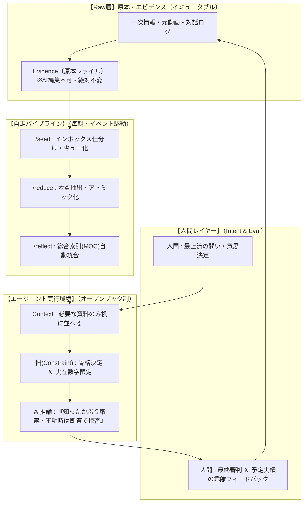

# 🧠 AIエージェント×第二の脳：知識自走とハルシネーション根絶のための5大設計原則

本ドキュメントは、個人ナレッジマネジメント（第二の脳 / LLM Wiki）およびAIエージェントの現場で実証された5本の先端知見を総合・構造化し、**「知識の死蔵を防ぎ、自走させ、かつAIの知ったかぶり（ハルシネーション）を構造的に根絶する」**ための実践的アーキテクチャ規範です。

---

## 🔗 一次情報源（インプット出典）

1. [Shiba Aki: 「第二の脳を作ったが活かせない」をどう超えるか？AIエージェント設計の思想を個人ナレッジに適用し、思考を自走させるアプローチ](https://note.com/48aki/n/n01ca1dc7f9ac)
2. [AIエンジニアになりたい60代男子: 毎朝4時に知識が積み重なる仕組みを作った話](https://note.com/smile_massu/n/n41da045fed8d)
3. [リンククロスシステム公式: AIアルゴリズム②：なぜAIは知ったかぶりをするのか？「RAG（検索拡張生成）」を徹底解説](https://note.com/linkc19/n/nac27d39a823c)
4. [ブラックにゃー: 「わかりません」と言えるAIを、私は毎日つくっている ── AIの“もっともらしい嘘”（ハルシネーション）の正体と、今日からできる見抜き方](https://note.com/blacknyaa/n/nd21b02fe34fc)
5. [AIで「できる」を増やす研究室（タイパ戦隊）: AIに記事を書いてもらうとき、僕が「元の会話」を必ず残す理由](https://note.com/taipasentai/n/n2a987b336528)

---

## 🏛️ 第1章：比較分析マトリクス（5本の思想と設計アプローチ）

| 視点 / 著者 | ぶつかった壁（課題） | 根本原因の洞察 | 解決のためのアーキテクチャ | 現場の教訓・名言 |
|---|---|---|---|---|
| **1. Shiba Aki** | 第二の脳を作ったが、日常の意思決定やアウトプットに活かせない | ナレッジベース自体は「受動的な本棚（ストレージ）」に過ぎない | **エージェント4レイヤー** （Context / Harness / Loop / Intent & Eval） イベント駆動で過去の自分が話しかけてくる状態を作る | 「知識は、使われて初めて価値を生む」 DoingをAIに、Being（問いと評価）を人間に |
| **2. 60代男子** | 本や記事を読んでも「読んで終わり」で知識として定着しない | GUI操作や手動実行は習慣に依存し、三日坊主で止まる | **CLIスケジューリング×3ステップパイプライン** `/seed`（取込）➔ `/reduce`（抽出）➔ `/reflect`（MOC統合） | 「情報を読む」から「知識を蓄積する」へ。 習慣に頼らず、仕組みで毎朝堆積させる |
| **3. リンククロス** | 企業でAIを導入する際、業務独自ルールを捏造してしまい実務で使えない | LLMは「事実を確認して答える」のではなく「確率の高い単語パズル」を解いている | **オープンブック試験（RAG）** ベクトルDBとセマンティック検索により、モデルに学習させず最新カンペを渡す | AIにカンペを渡して、それを見ながら答えさせるオープンブック形式のテスト |
| **4. ブラックにゃー** | AIが自信満々に嘘（存在しない判例やメニュー）を語り、業務で事故を起こす | マークシート試験と同じ。空欄は0点だが当てずっぽうなら当たるため「空欄を作らない子」に育つ | **「わかりません」と言わせる設計** 知ったかぶりの厳罰化と、不確かさを表明したときの部分点評価 | 「知るを知ると為し、知らざるを知らずと為す」（論語） 「わかりませんは一時の減点、知ったかぶりは一生の信用問題」 |
| **5. タイパ戦隊** | 長い対話から記事を作ると、元にない出来事・感情・「数字」を勝手に補完する | AIは文章を滑らかにつなぐために、空白を埋めるのが上手すぎる | **Evidence（根拠）紐付け ＆ 柵（Constraint）** いきなり本文を書かせず、骨格とエビデンス内数字のみに制限 | 「AIに嘘をつかせない」ではなく「嘘をつきにくくする」設計 |

---

## 💎 第2章：自走と正確性を両立する「5大設計原則」

### 原則1：受動的検索を捨て、イベント駆動型ループを回す（Shiba Aki原則）
- **本棚の罠の克服**: 「知りたいときに検索する」運用は必ず破綻する。人間が探すのではなく、システム側から関連コンテキストがプッシュされる環境を作る。
- **4レイヤーの循環構造**:
  1. **Context（文脈）**: 過去のメモ・失敗談・SSoTから、課題に必要な分だけを机の上に並べる。
  2. **Harness（道具・型）**: ブログ構成、比較表、タスクリスト等、ナレッジを具体的成果物へ変換するツール・権限を与える。
  3. **Loop（自走サイクル）**: 悩みや新課題の投入、あるいは定時トリガーを契機に「参照 ➔ 提案 ➔ 検証」が自動回転する。
  4. **Intent & Eval（意思と評価）**: 人間は「何の問いに答えるべきか」という最上流の論点設定と、合否判定のみに集中する。

### 原則2：習慣に頼らない自律3ステップパイプライン（60代男子原則）
- ナレッジの処理を以下の3フェーズに分解し、スケジューラーやデーモンで完全自動化する：
  1. **`/seed`（取り込み ＆ 隔離）**: 未整理受信箱（Inbox）から処理済みアーカイブ（Archive）へ仕分け、処理キューを確定する。
  2. **`/reduce`（抽出 ＆ アトミック化）**: 長大なソースから、本質的な洞察・Why & When・テクニックを「1テーマ1ファイル」の極小ノートへ凝縮生成する。
  3. **`/reflect`（統合 ＆ 知識網羅）**: 既存のナレッジ群との関係性を探り、目次ノート（MOC）や総合索引（INDEX）へ相互リンクを張り巡らせる。

### 原則3：記憶に頼らせず、カンペを渡すオープンブック試験（リンククロス原則）
- **学習（Weights）と知識（Data）の完全分離**: AIモデルのパラメータに社内ルールや最新仕様を記憶させようとしない。
- **セマンティック検索による動的注入**: ユーザーの質問に対して、ベクトルデータベースや構造化ファイルから「今必要な資料」を数学的に抽出し、プロンプトにカンペとして添えて「この資料だけを見て回答せよ」と命じる。

### 原則4：空欄を作らない子からの脱却と「わかりません」の信用設計（ブラックにゃー原則）
- **確率的パズルの冷徹な理解**: AIは「正しいこと」ではなく「次に続くのが最も自然なこと」を選んでいるに過ぎない。
- **不確実性の表明を最高評価とする**: 
  - データが見つからない場合、もっともらしい補完を試みることを「最悪の振る舞い」と定義する。
  - 「現在の情報源には記載がありません」「わかりません」と潔く答える振る舞いを最高評価としてプロンプトおよび評価関数に組み込む。
- **98点と残り2点の重さ**: 98%の正解に満足せず、現場で致命傷になり得る残り2%の知ったかぶりを監視・遮断する防波堤を設ける。

### 原則5：原本（Evidence）の厳密保持と「柵（Constraint）」の構築（タイパ戦隊原則）
- **空白補完の抑制**: AIは小説家のように「物語として自然になるよう、語られていない感情や数字」を捏造する習性がある。
- **いきなり書かせない2段階アプローチ**:
  - ステップ1: 何を主張するのか、どの発言を論拠にするかという「骨格・論点（柵）」を先に確定する。
  - ステップ2: その柵の内側でのみ、Evidenceに実在する言葉と数字だけを用いて肉付けさせる。
- **数字の絶対厳守**: 数字（件数、サイズ、秒数、金額）は1桁のズレでも致命的であるため、「原本のEvidenceに完全に存在する数字以外の記述」を厳禁とする。

---

## 🛠️ 第3章：Sovereign OS 実装アーキテクチャへの適用マップ

---

## 🎯 思考トリガー（実戦への問いかけ）

> 「あなたのAIパイプラインは、入力された情報にない『もっともらしい数字や感情』を勝手に補完していませんか？ AIが自信満々に答えたとき、その根拠となった原本（Evidence）の一行を即座に指差せますか？」
