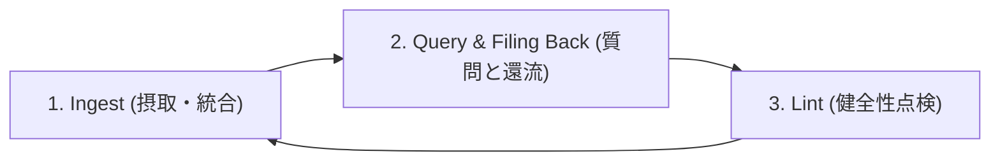

# 🧠 AIエージェント駆動型「第二の脳」構築・運用規範 (Second Brain Codex)

本ドキュメントは、Andrey Karpathy氏の提唱する「LLM Wiki」思想、および最先端のAIエージェント×ローカルナレッジ（Obsidian/Markdown）実践者たちの知見を統合し、Sovereign OSにおける知識の収集・蓄積・活用・自己点検（Lint）の全プロセスを規定する**最上位ナレッジアーキテクチャ規範**です。

---

## 🔗 一次情報源（インプット出典）

本規範は以下の知見を総合・構造化して制定されました：
1. [Tomo San: 育てた「第二の脳」、AI Agentにどう使わせる？ 「メモして」では作れない外部メモリーの設計](https://note.com/rlhwbs_office/n/ncdaca694e33e)
2. [Lumi Spark: AIに仕事を覚えさせても、会社は賢くならなかった——「第二の脳」を作って分かった、記録と学習の違い](https://note.com/lumispark/n/n07e7ac3341fe)
3. [ハシ: 「第二の脳」を自動で育てる。AIエージェント×Obsidianで始める自律型ナレッジベース構築術](https://note.com/my_yakuji_lab/n/nc183cdfcbe66)
4. [知恵の門: Claude CodeとObsidianによる「第二の脳」構築・運用方法（Andrey Karpathy氏のLLM Wiki）](https://note.com/mg185/n/nbb436cfb781d)
5. [TOMO: 【徹底解説】断片的な思考を「生きた資産」に変える。AIを活用した高度なナレッジマネジメントと「第2の脳」の構築術](https://note.com/sane_shrew1585/n/n9cee4a020991)

---

## 🏛️ 第1章：設計思想とパラダイムシフト

### 1.1 RAGの限界と「知識のコンパイル（LLM Wiki）」
従来のRAG（検索拡張生成）は、質問されるたびに大量のテキスト断片（チャンク）を検索し、その場限りで貼り合わせる方式でした。これは**質問のたびに車輪を再発明**しており、対話が終われば洞察は消失し、システム自体は賢くなりません。

これに対し、本システムが採用する**LLM Wiki（知識のコンパイル）**アプローチでは：
- 新しい情報が入った段階で、AIが深く読み込み、重要な概念・固有名詞を抽出し、既存の知識体系（Markdown Wiki）へ**事前にコンパイル（統合・更新・相互リンク付与）**します。
- 過去の記述との矛盾は事前にフラグ付けされ、知識が体系化されているため、質問時には瞬時に深い文脈から高精度の判断が引き出されます。

### 1.2 記録と学習の違い：真の「完了」の再定義（Lumi Spark原則）
- **単なる記録**: 過去の見積書や会議録を100件保存しても、判断力は向上しない（「そこに情報がある」で止まる）。
- **会社の経験（学習）**: **「予定（期待値）と実績の乖離」＋「その差が出た理由・原因」**が知識層へフィードバックされて初めて経験となる。
- **「完了」の再定義**: 納品・コードマージ・試合終了で作業は終わらない。「予定、実行、実績、乖離、原因、次回への改善基準」をナレッジへ戻して初めて一つの仕事が閉じる。

### 1.3 サンドイッチ・アプローチ（ハシ原則）
AIと人間の役割境界を厳格に定義します。
- **人間（意思決定者・ディレクター）**: 一次情報のインプット、重要度の判定、採用・不採用の意思決定、洞察の付加。
- **AIエージェント（専属ナレッジエンジニア）**: 泥臭い整理（Grunt work）、読解、要約、構造化、相互リンク貼り、矛盾点検、目次更新。

---

## 📁 第2章：3層ディレクトリ構造と境界設計

Karpathy氏の定義に基づき、ファイルシステムを以下の3層に明確に分離します。

```
[Vault Root]
├── 01_INTEL/ (raw/ 相当)        ➔ 不変の原本・客観的事実・SSoT
├── 02_FACTORY/ (wiki/ 相当)     ➔ AIが維持・統合する構造化成果物・ドラフト・日誌
├── .agent/rules/ (CLAUDE.md相当) ➔ システムの憲法・行動規範・運用スキーマ
└── NEXUS_INDEX.md               ➔ 全体の単一エントリーポイント（MOCハブ）
```

### 2.1 Raw層（原本・SSoT）：イミュータブル原則
- Webクリップ、公式パッチノート、論文PDF、YouTube文字起こし、現場生メモを格納。
- **最上位ルール**: **AIは原本ファイルを絶対に直接編集・破壊してはならない**。常に別名・派生ノートとして構造化する。ハルシネーションに対する物理的防波堤とする。

### 2.2 Wiki層（構造化知見）：AI主導の維持管理
- 概念（Concepts）、エンティティ（Entities）、要約（Summaries）、バイブル（Bibles）、意思決定ログを格納。
- AIが継続的に相互リンク（`[[リンク]]`）を張り、知識のネットワークを育成する。

### 2.3 境界設計の5大原則（Tomo San原則）
外部メモリーを機能させるため、以下の5項目を各作業で常に明確にする：
1. **何を覚えるか**: 客観的事実、決定事項、予定と実績の差。
2. **誰の、どの仕事の記憶か**: プロジェクトやリポジトリごとの厳格なコンテキスト分離。
3. **いつ、何を読ませるか**: 初手で読むエントリーポイント（`NEXUS_INDEX.md` / `TODO.md`）の固定。
4. **何を正しい前提とするか**: 確定事項（Verified）と仮説・検討中（Experimenting）の厳密な分離。
5. **作業結果の何を、どこへ戻すか**: 没理由・判断経緯・次回アクションの還流先の定義。

---

## 🔄 第3章：ナレッジ循環の3大プロセス



### 3.1 プロセス1：Ingest（摂取・統合）
新しい情報源が投函された際、AIエージェントは以下の順序で処理する：
1. **全文読解 ＆ コア抽出**: TOMOフレームワークに基づき、以下の3要素を抽出。
   - `Core Concept`: 一言でいうと何についての知見か
   - `Structured Points`: 体系化された要点（箇条書き）
   - `Actionable Steps`: 実務・実装への接続（次の一手）
2. **差分検出 ＆ 矛盾フラグ**: 既存のバイブル・知識と照合し、新しい知見が過去の記述と矛盾する場合は勝手に上書きせず、「⚠️ 過去方針との差分・変更点」として明記する。
3. **相互リンク ＆ MOC更新**: 関連する既存ノートおよび目次ノート（MOC）へ即座にリンクを追記する。

### 3.2 プロセス2：Query ＆ Filing Back（還流）
- AIエージェントとの対話や作業を通じて生まれた「優れた分析結果」「比較検証」「設計判断」「没理由」は、チャットログの彼方に消去させてはならない。
- セッション完了時に、必ず該当のバイブルまたは `DAILY_LOG.md` へ**即座に還流（Filing Back）**する。

### 3.3 プロセス3：Lint（ナレッジ健全性点検）
定期的にナレッジベース全体の健全性をスキャンし、以下を検出・是正する：
- **孤立ノートの検知**: 他のどのノートからもリンクされていない孤立ファイルの特定。
- **相互参照の不足**: 関連しているにもかかわらずリンクされていない概念の結合。
- **陳腐化リスク（Decay Risk）の評価**: 古い仕様・パッチの記述を検知し、`[旧]` ラベルの付与または最新化。
- **リサーチバックログ（知識のギャップ）の提案**: 「〇〇に関する言及が多いが詳細ノートが不足している」等の追加調査タスクの自動起票。

---

## 📋 第4章：フォーマット標準化（YAML Frontmatter規約）

全ノートの冒頭には、以下の統一メタデータを付与し、人間とAIの双方が機械的・直感的に状態を把握できるようにする。

```yaml
---
title: "ノートの正式名称"
status: verified # verified（実戦確定）| experimenting（検証中）| deprecated（旧仕様）
source_type: official # official（公式SSoT）| empirical（実戦実測）| ai_derived（AI派生）
published_at: 2026-XX-XX # 一次情報の公開日
captured_at: 2026-XX-XX  # 保存・取込日時
verified_at: 2026-XX-XX  # 内容確認日・実測検証日（未確認なら unverified）
tags: [カテゴリ, トピック, レベル]
---
```

---

## 🎯 思考トリガー（実戦への問いかけ）

> 「現在進行中の機能実装やコンテンツ制作において、作業完了後に『予定と実績の乖離』および『採用しなかった没案の理由』をナレッジ層へ還元する動線が、作業フローの中に組み込まれているか？」
