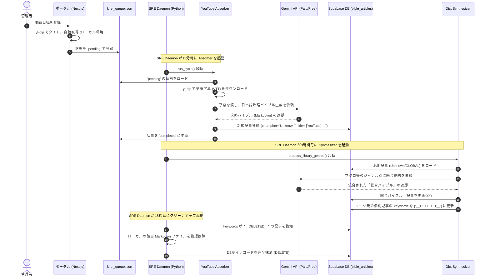
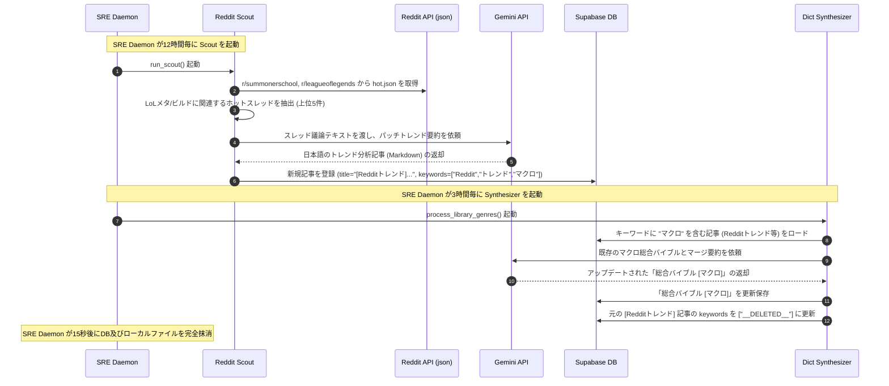

# Sovereign OS & KTM Bot 詳細設計仕様書 (Detailed System Design Specification)

Sovereign OS プロジェクトにおける、Webポータル、大会運営Bot (KTM Bot)、コア自動化エンジン、およびデータベース (Supabase) の全体像、機能、データ連携、およびロジックの設計仕様を詳細に定義します。本ドキュメントは、今後の機能追加やシステム改修時の「単一真実源 (Source of Truth)」として機能します。

---

## 1. システム全体アーキテクチャ (System Architecture)

Sovereign OS は、Supabase データベースおよび Google Sheets を中心とし、フロントエンド（Next.js / Discord）とバックエンド自動化エンジン（Python Core / Cloudflare Workers / GAS）が連携する分散イベント駆動型アーキテクチャです。

### 1-1. システム関連図

```mermaid
graph TD
    %% ユーザーおよびインターフェース
    User[ユーザー / プレイヤー] <--> |Discord Slash Cmd / UI| Discord[Discord Server]
    User <--> |Webブラウザ| Portal[Web Portal (Next.js)]

    %% Discord Bot 連携
    Discord <--> |Interactivity Webhook| Workers[KTM Bot (Cloudflare Workers)]
    Workers <--> |HTTPS API Call| GAS[Google Apps Script (GAS)]
    GAS <--> |Read/Write| Sheets[Google Sheets (DB/MMR)]
    GAS <--> |HTTP Trigger| PortalAPI[Portal API (Next.js)]

    %% Webポータル 連携
    Portal <--> |Read/Write| Supabase[(Supabase DB)]
    PortalAPI <--> |Read/Write| Supabase

    %% Sovereign OS コア (Python)
    subgraph Sovereign_OS_Core [Sovereign OS Core Engine]
        SREDaemon[SRE Daemon]
        DictSynthesizer[Dict Synthesizer]
        YTAbsorber[YouTube Absorber]
        RedditScout[Reddit Scout]
        Pulse[Sovereign Pulse]
    end

    SREDaemon --> |Watch Log / Cleanup| Supabase
    SREDaemon --> |Metrics Save| Supabase
    DictSynthesizer <--> |Fetch / Merge / Mark deleted| Supabase
    YTAbsorber <--> |Read Queue / Write Video Data| Supabase
    RedditScout <--> |Scrape Trends / Write Articles| Supabase
    Pulse --> |Observer SoloQ / Scraping| Supabase
    Sovereign_OS_Core <--> |AI Request| Gemini[Gemini API (ai_helper)]
```

### 1-2. データフローシーケンス

#### A. YouTube動画攻略ライブラリ化 & 辞典マージのライフサイクル
ポータルから動画URLが登録され、自動マージ、そして不要ファイルが一掃されるまでの全フローです。



#### B. Redditトレンド自律検出 ＆ 総合バイブル自動マージのフロー
海外のRedditからLoLのメタ情報を自律検知し、自動的に攻略ライブラリへ蓄積するフローです。



---

## 2. データベース設計 (Database Schema & Security)

### 2-1. Supabase テーブル定義

#### A. `bible_articles` (攻略ライブラリ記事)
マクロ判断や、各チャンピオンごとの攻略バイブル記事、および一時的なトレンド記事をMarkdown形式で保存します。

| カラム名 | データ型 | 制約 | 説明 |
| :--- | :--- | :--- | :--- |
| `id` | int8 | PRIMARY KEY (Identity) | 記事の一意ID |
| `created_at` | timestamptz | DEFAULT `now()` | 作成日時 |
| `title` | text | UNIQUE | 記事タイトル (例: `[総合バイブル] マクロ`) |
| `content` | text | - | 記事本文 (Markdown形式) |
| `champion` | text | - | 対象チャンピオン名 (指定なしは `Unknown`, `GLOBAL` 等) |
| `keywords` | text[] | - | 検索タグ・ジャンル名 (例: `["マクロ", "総合バイブル"]` / 削除用タグは `["__DELETED__"]`) |
| `file_path` | text | - | ローカルのMarkdownファイルの保存先絶対パス |

#### B. `matchup_sentinel` (チャンピオン辞典 & 戦術データ)
各チャンピオンごとの対策やGLOBALなマクロ、さらにダッシュボード用システムメトリクス（ID: `SYSTEM_METRICS`）を保持します。

| カラム名 | データ型 | 制約 | 説明 |
| :--- | :--- | :--- | :--- |
| `id` | int8 | PRIMARY KEY (Identity) | レコードの一意ID |
| `created_at` | timestamptz | DEFAULT `now()` | 作成日時 |
| `matchup_id` | text | UNIQUE | 識別キー (例: `GLOBAL`, `SYSTEM_METRICS`, `{ChampName}_GLOBAL`) |
| `title` | text | - | チャンピオン名やタイトル |
| `champion` | text | - | チャンピオン名 |
| `enemy` | text | - | 对面チャンピオン名 (基本対策は `GLOBAL`) |
| `strategy` | text | - | 対面戦術・反省会から得られた鬼コーチの教訓 |
| `raw_data` | jsonb | - | 拡張用JSONデータ。`note_draft` (noteドラフト原稿) や `logs` (最新ログ)、`queue` (YouTubeキュー件数) を内包 |

#### C. `api_usage_logs` (API使用量ログ)
1日あたりのAPI（Gemini等）の消費トークン・リクエスト数を蓄積し、クォータオーバーを防止します。

| カラム名 | date | PRIMARY KEY | 利用日 (日付) |
| :--- | :--- | :--- | :--- |
| `calls` | jsonb | - | 機能ごとのAPI呼び出し回数・エラーカウント履歴 |

---

### 2-2. Row Level Security (RLS) ポリシー

全世界に安全に公開するため、Supabase上の各テーブルに以下のRLSを適用しています。

```sql
-- 読み取り許可 (未認証の一般ユーザーを含め、全員に許可)
CREATE POLICY "Allow read for all" ON bible_articles FOR SELECT USING (true);
CREATE POLICY "Allow read for all" ON matchup_sentinel FOR SELECT USING (true);

-- 書き込み・更新許可 (認証済み管理者アカウントのみに制限)
CREATE POLICY "Allow insert for admin" ON bible_articles FOR INSERT TO authenticated WITH CHECK (true);
CREATE POLICY "Allow update for admin" ON bible_articles FOR UPDATE TO authenticated USING (true);
CREATE POLICY "Allow delete for admin" ON bible_articles FOR DELETE TO authenticated USING (true);

CREATE POLICY "Allow insert for admin" ON matchup_sentinel FOR INSERT TO authenticated WITH CHECK (true);
CREATE POLICY "Allow update for admin" ON matchup_sentinel FOR UPDATE TO authenticated USING (true);
```
*※ローカルまたはVPSで動作する Python Core モジュールは、認証をバイパスする `service_role` キーを使用して書き込みを行います。*

---

## 3. Webポータル APIインターフェース仕様 (Web Portal API)

Next.js (App Router) 側の管理者専用APIエンドポイントの仕様です。インポート解決時のビルドエラーを避けるため、絶対パスエイリアス (`@/`) は使用せず、相対パスを厳守しています。

### 3-1. `/api/admin/design` (設計書編集・自動デプロイ)
ポータルからシステム設計書（`SYSTEM_DESIGN.md`）を上書きし、自動で Git Commit/Push をトリガーします。

* **メソッド**: `POST`
* **認証**: Basic認証必須
* **リクエストボディ**:
  ```json
  {
    "content": "# 新しい設計書本文 (Markdown)"
  }
  ```
* **レスポンス (200 OK)**:
  ```json
  {
    "success": true,
    "message": "設計書を保存しました。バックグラウンドで自動デプロイを開始しました。"
  }
  ```
* **非同期挙動**:
  APIはファイル書き込み後、ただちにレスポンスを返却し、バックグラウンドで以下のシェルコマンドを非同期に `exec` します：
  ```bash
  git add ../SYSTEM_DESIGN.md src/app/design/SYSTEM_DESIGN.md && git commit -m "docs: update system design via portal dashboard" && git push origin master
  ```

### 3-2. `/api/admin/youtube` (YouTubeキュー管理)
ポータル上のYouTubeキュー管理UIからの指示をハンドリングします。

* **メソッド / 挙動**:
  - **`GET`**: `kirei_queue.json` の全リストを返却。
    - **レスポンス (200 OK)**:
      ```json
      [
        {
          "id": "1MZbnoN064o",
          "title": "Master Yi Guide",
          "url": "https://www.youtube.com/watch?v=1MZbnoN064o",
          "status": "completed",
          "retry_count": 0
        }
      ]
      ```
  - **`POST`**: 新規動画をキューに登録。
    - **リクエストボディ**: `{"url": "https://www.youtube.com/..."}`
    - **処理フロー**: `yt-dlp` が利用可能なローカル環境の場合は自動で動画の `title` を取得。無ければ `YouTube Video` として登録。IDの重複があれば `400 Bad Request`。
  - **`PUT`**: 特定動画のステータス書き換え（再試行指示など）。
    - **リクエストボディ**: `{"id": "1MZbnoN064o", "status": "pending"}`
    - **挙動**: 指定ステータスに上書きし、`retry_count` を `0` にリセット。
  - **`DELETE`**: キューから該当動画を削除。
    - **リクエストボディ**: `{"id": "1MZbnoN064o"}`
  - **`PATCH`** [New]: エラー状態にある動画を一括再試行。
    - **リクエストボディ**: `{"action": "retry_all_errors"}`
    - **挙動**: キュー内でエラー状態（`error_generation`, `error_no_transcript`, `failed`）の動画をすべて `pending` にリセットし、`retry_count` を `0` にクリアします。


### 3-3. `/api/mmr/rebuild` (MMR再計算)
過去の全試合結果から、全プレイヤーの各レーンMMRおよび総合MMRを時系列に沿って一括再計算・更新します。

* **メソッド**: `POST`
* **認証**: 管理者キー `SUPABASE_KEY` / `SUPABASE_SERVICE_ROLE_KEY` を内部解決して RLS ポリシーをバイパス。
* **処理フロー**:
  1. 全プレイヤー of MMRを初期値（最高ランクと希望ロールに基づく値）でリセット。
  2. `ktm_matches` を `created_at` 昇順で取得し、1試合ごとに全参加者のMMR変動値（`delta`）を動的に対面MMRを参照して再計算（A方式）。
  3. 各試合の参加者の `mmr_delta` と、プレイヤーの最終MMRを Supabase に一括保存。更新対象行数 0 行時の安全ガード例外を搭載。
* **レスポンス (200 OK)**:
  ```json
  {
    "success": true,
    "message": "Rebuild completed for 55 players over 70 matches."
  }
  ```

### 3-4. `/api/mmr/check-integrity` (MMR整合性検証)
メモリ上の累積シミュレーション値と、データベース（`ktm_players`）に保存されている最終MMR値の整合性を検証します。

* **メソッド**: `GET`
* **処理仕様**:
  - **ロール名の表記揺れ吸収**: 参加者データからキー名を生成する際、ロール名を `toUpperCase()` に変換して `expectedJg` / `expectedSup` などのキャメルケースで正しく期待値を読み込む。
  - **極小誤差の許容（しきい値）**: 浮動小数点演算や丸め処理に伴う 1～2 程度の極小誤差（IEEE 754丸め誤差）による偽陽性を防ぐため、各レーンの差が **`2` 以内** であれば整合（不整合なし）と判定する。
* **レスポンス (200 OK - 不整合なし時)**:
  ```json
  {
    "success": true,
    "hasDiscrepancy": false,
    "discrepancyCount": 0,
    "discrepancies": []
  }
  ```

### 3-5. `/api/admin/affiliate/links` (アフィリエイトリンク管理) [New]
紹介用アフィリエイト案件のURLマッピングを管理します。

* **メソッド**:
  - **`GET`**: `02_FACTORY/affiliate_links.json` のキー（ツール名）と値（紹介URL）のJSONを返却。
  - **`POST`**: 受け取ったJSONデータで `affiliate_links.json` を上書き保存。URLのバリデーション（http/https判定）を搭載。

### 3-6. `/api/admin/affiliate/generate` (自動記事生成バッチ) [New]
ITツールのトレンド収集からnote下書き保存・X投稿までを行うバッチを操作します。

* **メソッド**:
  - **`GET`**: 現在バッチが実行中かどうか（ロックファイルの有無で判定）およびログファイル `00_LOGS/monetization_batch_run.log` の最新200行を返却。
  - **`POST`**: `python 03_SYSTEMS/v2_CORE/monetization_batch.py` を非同期で子プロセス起動。`dryRun` オプションを渡すことで、実際の投稿を行わない検証（ドライラン）実行が可能。

### 3-7. `/api/admin/affiliate/analytics` (アクセス分析) [New]
note.comでのアクセス状況データを取得します。

* **メソッド**: `GET`
* **処理内容**: Geminiによる最新のAI分析フィードバック（`note_analytics_feedback.json`）の読み込み、および Supabaseの `note_pv_history` テーブルから最新50件のアクセスランキング履歴を取得して返却。

### 3-8. `/api/admin/affiliate/knowledge` (副業ナレッジ) [New]
アフィリエイトのノウハウなどのテキストドキュメントを管理します。

* **メソッド**:
  - **`GET`**: `02_FACTORY/affiliate_knowledge.md` のテキスト本文を返却。
  - **`POST`**: 送信されたMarkdownテキストで `affiliate_knowledge.md` を上書き保存。

---


## 4. コア自動化エンジン詳細設計 (Sovereign OS Core)

Python バックエンドモジュールにおけるクラスとロジックの設計です。

### 4-1. 常駐監視デーモン (`sre_daemon.py`)
システムエラーを自律的に監視しつつ、各種軽量化タスク・メトリクス連携を別スレッドで並行実行する常駐型デーモンです。

* **主要メソッド**:
  - `run()`: メインスレッドで `sovereign_os.log` のサイズ変更と例外検知を1秒おきにポーリング監視。同時に、4つの並列デーモンスレッド（`DictSynthesizer` ループ、`YouTubeAbsorber` ループ、`RedditScout` ループ、`Cleanup` ループ、`Metrics` ループ）を起動。
  - `_process_error_buffer(error_buffer)`: エラー文字列からMD5ハッシュで指紋を生成。1時間以内の同一エラーは通知を抑制。新規エラーは `analyze_error_with_ai()` を実行して Discord へ通知。
  - `analyze_error_with_ai(error_text)`: Gemini API を使用し、エラー原因と「次にユーザーがとるべき解決アクション」を要約。

* **スレッド並行タスク仕様**:
  1. **DictSynthesizer (3時間おき)**: `dict_synthesizer.py` を外部プロセスとして `subprocess.run` 実行。
  2. **YouTubeAbsorber (15分おき)**: `youtube_absorber.py` を外部プロセスとして実行。API制限回避のため、1回の起動で最大3本のみ処理。
  3. **RedditScout (12時間おき) [New]**: `reddit_scout.py` を外部プロセスとして実行。
  4. **Cleanup (15秒おき)**: Supabaseで `__DELETED__` キーワードを持つ記事レコードをスキャンし、対応するローカル Markdown ファイルを削除後、Supabaseから物理 `DELETE`。
  5. **Metrics (15秒おき)**: YouTubeのキュー残数やログ末尾20行を集計し、Supabaseの `SYSTEM_METRICS` レコードに `UPSERT` 送信。

### 4-2. Redditトレンド自律収集 (`reddit_scout.py`) [New]
Redditからメタ情報・ビルドの流行を検知し、自動的に攻略ライブラリ（`bible_articles`）へ流し込む自律スカウトエンジン。

* **主要メソッド**:
  - `fetch_reddit_trends(subreddit, limit)`: RedditのパブリックJSON（例: `r/summonerschool/hot.json`）へ、カスタム User-Agent ヘッダーを付与して GET リクエストを送信。タイトルや本文に LoL 関連キーワード（`build`, `meta`, `patch` 等）が含まれるスレッドを最大5件抽出。
  - `analyze_trends(posts)`: 抽出したスレッドの議論テキストを結合し、Gemini API (`gemini-2.5-pro` / Paid) に送信。日本語でトレンド分析ドキュメント（要約・ルーン・ビルド評価・対策）を生成。
  - `run_scout()`: 上記を実行し、取得データを Supabase の `bible_articles` テーブルに登録。同時にローカルの `02_FACTORY/bible/kirei_bible/` 配下に `{日付}.md` 形式で保存。

### 4-3. API頻度制限・キー制御モジュール (`ai_helper.py`)
クォータ制限 (429) やサーバー一時エラー (503) からシステムを死守する、高耐久なAPIラッパー。

* **主要ロジック (generate_content_safe)**:
  - **頻度制御**: `api_throttle.lock` によるファイルロック制御と強制スリープにより、全プロセス合計でのリクエスト間隔を最低 **20.0秒** 空ける。
  - **フォールバック**: 無料キー（`GEMINI_API_KEY_FREE`）で最大3回試行し、429制限を検知した場合は即座に処理を打ち切って有料キー（`GEMINI_API_KEY`）に切り替え。有料キーでは最大15回の指数バックオフ（Exponential Backoff）リトライを実行。
  - **モデル自動遷移**: 404エラー（非推奨モデル `gemini-1.5` などの指定）を検知した場合は、キー切り替えをスキップして次の優先モデル（`gemini-2.5-pro` ➔ `gemini-2.5-flash` ➔ `gemini-2.0-flash`）へ移行。

---

## 5. KTM Discord Bot 設計 (`ktm_bot`)

KTM Bot は、LoLカスタムマッチのメンバー募集、レーン決定、チーム分け、戦績管理を Discord 上で完結させるDiscord Botです。

### 5-1. 実行環境とデータ連携
* **Cloudflare Workers (Edge)**: Discordからのスラッシュコマンドやボタンインタラクションの Webhook を超高速かつ低遅延でレシーブ。暗号署名検証（`discord-interactions`）を行い、バックエンドの GAS へ HTTPS 経由でデータをリレー。
* **Google Apps Script (GAS)**: 全てのマッチング、チーム分け、MMRの計算を実行するコアバックエンド。
* **Google Sheets (データベース)**: `対戦入力`, `メンバーデータ`, `対戦履歴` などのシートをデータベースとして活用。

### 5-2. KTM Balancer チーム分けロジック仕様
バランサーは、単なるランダム分けではなく、プレイヤー全員が納得しつつ、ゲームが最も均衡する組み合わせを以下のアルゴリズムで決定します。

* **状態変数**:
  1.  **MMR (内部レート)**: 各プレイヤーはロール（TOP, JG, MID, ADC, SUP）ごとに独立したMMRを保有（初期値: 1200）。勝敗結果と対面とのMMR差に基づいてEloレーティング式（K=32）で増減。
  2.  **Pity (不運度 / 調整弁)**: 希望レーンに配置されなかった不満度を累積するカウンター。
      - メインレーンに配置: `0` にリセット
      - サブレーン（第2希望）に配置: `+2`
      - NGまたは希望外レーンに配置: `+5`
      - 定員オーバーで試合に出られず観戦/待機: `+10`
      *※Pity値が高いプレイヤーほど、次回のチーム分けで優先的にメインレーンに選出されます。*

* **配置ペナルティ評価アルゴリズム**:
  全プレイヤーのロール割り当ての全パターンに対し、以下のペナルティ加算処理を行い、**総合ペナルティが最小となる組み合わせ**を選出します。
  1.  **NGレーン配置ペナルティ**: `2,000,000 pt` (絶対回避)
  2.  **希望外（メイン・サブ以外）配置**: `500,000 pt` + (Pityによる割引補正)
  3.  **サブレーン配置**: `20,000 pt` + (Pityによる割引補正)
  4.  **こだわり度 (Weight) 補正**:
      - weight=1 (絶対): サブ/希望外配置時のペナルティを 50倍 に増幅
      - weight=3 (柔軟): サブ/希望外配置時のペナルティを 1/4 に軽減
  5.  **専門職（JG/SUP/ADC専）の希望外配置**: 追加ペナルティ (×2〜×3)
  6.  **初心者（試合数極少）の JG/MID 配置**: `1,000,000 pt` (大破滅ペナルティ)

* **チーム戦力均衡化処理**:
  ロール配置確定後、以下の項目を評価値として算出し、BlueチームとRedチームの戦力が最も近くなるようシャッフルします。
  1.  **対面MMR差の平準化**: 各レーン（例: Team A TOP vs Team B TOP）のMMR差の2乗和を最小化。
  2.  **総合MMR差の極小化**: チーム合計MMRの差を最小化。
  3.  **直近勝率の平準化**: 勝率が極端に高い人と低い人が同一チームに入りやすくなる補正。
  4.  **格上対面の保護**: MMR差が600以上開いている場合、メインレーン以外の対面配置に大ペナルティを設定。

## 6. Webポータル UI/UX 設計 (Web Portal UI/UX Design)

Sovereign OS Webポータルは、管理者および一般ユーザーの利用シーンに合わせて最適化された、高レスポンスで視認性の高いUI/UXを提供します。

### 6-1. PC用サイドバーの最小化（Collapse / Expand）仕様
PC大画面での作業領域を最大化するため、サイドバーを最小化する機能を備えています。
- **状態管理と永続化**:
  サイドバーの開閉状態（`isCollapsed`）は `localStorage` (`sovereign_sidebar_collapsed`) で保持され、画面の再読み込みや遷移後も設定が維持されます。
- **動的レイアウト**:
  - **展開時 (`w-64`, `p-8`)**: 通常のフルテキスト＆ロゴ表示。
  - **最小化時 (`w-20`, `px-3 py-6`)**:
    - ロゴ: アイコン (`Shield`) のみを表示し、文字 (`SOVEREIGN`) は非表示。
    - メニュー項目: ラベルテキストを非表示にし、アイコンを中央寄せで縦に整列して配置（ホバーでメニュー名がツールチップ視認可能）。
    - フッター: ステータスの緑点滅ドットのみを表示し、テキストを非表示。
  - **お気に入りパネルの変形**:
    最小化時はお気に入りチャンピオンの丸型アイコンのみを縦一列でコンパクトに表示し、記事一覧やラベルは非表示とします。

### 6-2. 管理者ログイン時のメニュー構成の整理とタブ化
管理者エリア（`/ktm-admin` 等）へのログイン時は、豊富な管理機能をすっきりと整理するため、メニューのグループ切り替えを導入しています。
- **「過去の試合履歴」の除外**:
  管理者の日常運用において不要な「過去の試合履歴」は、管理者メニューから除外されています。
- **メニュー表示切り替えタブ (PC版)**:
  サイドバー上部に「管理者機能」と「一般機能」を切り替えるタブUI（最小化時はアイコン付きトグル）を設置し、目的の機能にワンクリックで切り替え可能です。
- **スマホ版ボトムナビゲーション同期**:
  スマホ画面でメニューが横に溢れるのを防ぐため、ボトムナビの最後の項目に「一般へ」/「管理へ」の動的トグル切り替えボタンを配置し、表示項目をスマートに制御します。

### 6-3. 副業（アフィリエイト）管理UIの設計 [New]
管理者用メニュー内の新セクションとして、ネオングリーンを基調としたガラスモーフィズムSPA（Single Page Application）として設計されています。
- **タブベースインターフェース**: `Framer Motion` による滑らかなタブ切替アニメーション。
- **インラインリンク編集**: グリッド化されたアフィリエイトリンクのインライン書き換え機能。
- **コンソールログのストリーム表示**: バッチ実行ログの末尾200行を、自動スクロール機能付きのモック端末コンソール風UIに展開。
- **Markdownプレビューエディタ**: textareaとHTML簡易レンダリングの切替に対応。

---

## 7. 管理ポータル 使用説明書 (Portal Operations Manual) [New]

Sovereign OS 管理ポータルを安全かつ効率的に使用するための運用操作マニュアルです。

### 7-1. ダッシュボード (Dashboard)
システム全体の稼働状態およびリソースを監視する画面です。
1. **システムオンライン監視**:
   ヘッダー右側の点滅ランプが `SYSTEM ONLINE` になっていることを確認します。15秒おきに自動更新され、SREデーモンが正常稼働しているかを示します。
2. **API Quota (Gemini API 制限)**:
   1日あたり 1500回（無料枠上限）のリクエスト数に対する現在の消費量をプログレスバーで可視化しています。残り回数が少なくなっている場合は、自動実行バッチの頻度を抑えるなどの調整を行います。
3. **要確認タスク**:
   チャンピオン辞典の中で、対面対策戦略（strategy）が未入力、またはAIによる自動生成が不足している「要確認」の組み合わせが自動表示されます。クリックすると直接辞典ページへジャンプして入力できます。

### 7-2. YouTube管理 (YouTube Queue Manager)
攻略動画の自動要約キューを操作する画面です。
1. **新規動画の追加**:
   上部の入力欄にYouTubeの動画URL（短縮URL可）を入力して「追加」を押すと、バックグラウンドで `yt-dlp` が自動的に動画タイトル・チャンネル名・投稿日を取得し、キューに追加します。
2. **エラー動画の一括再試行**:
   字幕の取得失敗や一時的なAPIクォータエラー等により `failed` や `error_` になった動画が存在する場合、ヘッダー右側に **「🔄 エラー動画を一括再試行」** ボタンが表示されます。これをクリックすると、エラーのある動画すべてが `pending` にリセットされ、SREデーモンによって次回（最大15分後）に自動で再処理されます。
3. **動画のステータス手動変更・削除**:
   各動画カードのステータス表示をクリックして手動で `pending` に戻したり、不要な動画をゴミ箱アイコンから削除することが可能です。

### 7-3. 副業管理 (Affiliate & Monetization Control)
自動収益化とアフィリエイト運用を一元管理する画面です。4つのタブで構成されています。
1. **📊 アクセス分析**:
   - **AIトレンド分析**: noteに投稿した記事のアクセス推移を元に、Gemini AIが現在読者の興味を惹きつけている「人気キーワード」や「次に紹介すべき推奨ツール」を教えてくれます。週に1回、この分析結果を参考にアフィリエイトリンクの追加や記事執筆の方向性を決定します。
   - **アクセスランキング**: 直近のnote記事のPV数、スキ数、コメント数がランキング表示されます。どの記事がヒットしているかを定量的に把握できます。
2. **🔗 リンク管理**:
   - 紹介したいITツール・AIツールのアフィリエイトリンクを一覧で管理します。
   - 新規追加時は下部のフォームに「ツール名（例: Canva）」と「アフィリエイト紹介用URL（例: A8.net等で発行した紹介リンク）」を入力して追加し、右上の「リンクの保存」をクリックします。
   - 保存されたリンクは、自動記事生成時に自動的に記事本文内に埋め込まれます。
3. **🚀 自動バッチ実行**:
   - **実行ログの監視**: 右側の黒いコンソール画面に、Pythonバッチ `monetization_batch.py` の進行ログがリアルタイム風に表示されます。
   - **ドライラン（検証実行）**: 「ドライランで実行する」にチェックを入れて実行すると、記事の生成やXスレッドの構築までを行いますが、noteへの下書き保存やXへの実際の投稿を行わずに挙動をテストできます。新しいプロンプトやアフィリエイトリンクの埋め込みテスト時に推奨されます。
   - **本番実行**: チェックを外して実行すると、バッチが一気に実行され、note.comに自動で下書き保存され、Xにプロモツイートが3連投されます。
4. **🧠 副業ナレッジ**:
   - アフィリエイト運用のルールや、売れる記事のテンプレート、免責事項などのガイドラインをMarkdown形式で記述・保存できる専用メモ帳です。
   - 右上の「プレビュー表示」をクリックすることで、Markdownのプレビュー結果を視認できます。編集後は必ず「ナレッジを保存」をクリックしてください。

### 7-4. システム設計書 (System Design Guide)
ポータルからこのシステム設計書（`SYSTEM_DESIGN.md`）自体を直接編集できる画面です。
- 画面上のテキストエディタで内容を修正し、「設計書を保存」をクリックすると、ファイルがサーバーに書き込まれると同時に、バックグラウンドで `git commit & push` がトリガーされ、本番環境への自動再デプロイが実行されます。
- ※ Next.js のビルドプロセスにおいて、ビルド開始時に `node copy_design.js` が自動実行され、最新の `SYSTEM_DESIGN.md` がポータルの静的配信ディレクトリに自動同期される仕組みになっています。

### 7-5. コアエンジン手動起動コマンド一覧 (CLI Commands) [New]
システムの各種コアエンジンやデーモン、バッチ処理をVPSやローカル of コンソール（PowerShell等）から直接手動実行するためのコマンド一覧です。
※いずれもプロジェクトのルートディレクトリ（`d:\my_work`）で実行することを前提としています。

0. **一括起動バッチスクリプトの実行 (SREデーモン & Webポータルの並行一括起動)**
   Windows環境において、ダブルクリック、あるいはコンソールから実行することで、別ウィンドウを自動起動してSREデーモンとポータル開発サーバーを同時に立ち上げます。
   ```powershell
   .\start_systems.bat
   ```

1. **SRE常駐デーモンの起動 (システム全体の自動巡回・死活監視・メトリクス連携)**
   ```powershell
   $env:PYTHONPATH="03_SYSTEMS"; d:\my_work\.venv\Scripts\python.exe d:\my_work\03_SYSTEMS\v2_CORE\sre_daemon.py
   ```
   *※SREデーモンが起動していると、15分毎の動画解析、3時間毎の辞典マージ、15秒毎のクリーンアップ、メトリクス更新がすべて自動スレッドで並行処理されます。*

2. **アフィリエイト一気通貫バッチの手動実行**
   - **ドライラン（検証実行: note下書き・X投稿をせずに動作確認する場合）**:
     ```powershell
     $env:PYTHONPATH="03_SYSTEMS"; d:\my_work\.venv\Scripts\python.exe d:\my_work\03_SYSTEMS\v2_CORE\monetization_batch.py --dry-run
     ```
   - **本番実行（ヘッドレスモード: ブラウザを表示せずに実行）**:
     ```powershell
     $env:PYTHONPATH="03_SYSTEMS"; d:\my_work\.venv\Scripts\python.exe d:\my_work\03_SYSTEMS\v2_CORE\monetization_batch.py
     ```
   - **本番実行（目視モード: Playwrightブラウザの動きを目視確認しながら実行）**:
     ```powershell
     $env:PYTHONPATH="03_SYSTEMS"; d:\my_work\.venv\Scripts\python.exe d:\my_work\03_SYSTEMS\v2_CORE\monetization_batch.py --no-headless
     ```

3. **YouTube攻略動画の解析・要約 (YouTube Absorber 単発実行)**
   ```powershell
   $env:PYTHONPATH="03_SYSTEMS"; d:\my_work\.venv\Scripts\python.exe d:\my_work\03_SYSTEMS\v2_CORE\youtube_absorber.py
   ```
   *※キュー（Supabase）に溜まっている `pending` 状態の動画を解析・要約し、攻略記事としてDBに登録します。*

4. **辞典マージ・ブラッシュアップ (Dict Synthesizer 単発実行)**
   ```powershell
   $env:PYTHONPATH="03_SYSTEMS"; d:\my_work\.venv\Scripts\python.exe d:\my_work\03_SYSTEMS\v2_CORE\dict_synthesizer.py
   ```
   *※DB内の個別攻略記事をマージし、総合バイブルやチャンピオン辞典への統合アップデートを実施します。*

5. **ポータルのローカル検証サーバーの起動**
   ```powershell
   cd 04_PORTAL
   npm run dev
   ```

## 8. AIエージェント自律開発・協調プロトコル (Autonomous Agent Collaboration) [New]

Sovereign OSの自走化を極限まで高めるため、Antigravityのサブエージェント（仮想社員）機能を応用し、開発から監査までをAIだけで自己完結させる「自律開発エージェント協調システム（ADO: Autonomous Dev & Ops）」の設計仕様です。

### 8-1. マルチエージェントによる役割分担と信頼境界
親エージェント（Manager/Supervisor）が監督役となり、以下の3つの子エージェント（サブエージェント）を動的に定義・対話させます。
1. **💻 Coder (開発担当エージェント)**:
   - 目的: 指示された仕様を満たすコード変更（ファイル編集）を自律実行する。
   - ツール: `replace_file_content` などの非破壊編集ツール。
2. **🧪 Tester (テスト・ビルド検証エージェント)**:
   - 目的: 修正されたコードに対して、TypeScript型チェック（`tsc --noEmit`）やNext.jsのビルド（`npm run build`）を走らせ、構文エラーがないか検証する。
   - エラーを検知した場合は、ログをCoderに突き返して再修正を要求する。
3. **🛡️ Auditor (監査・セキュリティエージェント)**:
   - 目的: コミット前のGit差分を監査する。
   - 監査基準: 「AI臭いポエミー表現の排除（王・王国などの禁止語）」、「絶対パスエイリアス（@/）の禁止（ビルドエラー防止）」、「守りの三柱（RLS、HTTPS、免責事項）」のチェック。
   - 合格時のみManagerに承認（Approved）を発行する。

### 8-2. エージェント間のメッセージ駆動連携
- エージェント間の通信は、APIによるプログラム呼び出しではなく、**Antigravityの `send_message` を利用した自律チャット（プロンプト対話）** で実行されます。これにより、人間がチャットで指示してデバッグするプロセスが、AI同士のコンテキスト内で擬似的に完全に再現されます。
- Managerは最終的なAuditorの「Approved」を受けて、初めてGitコミットおよび本番への再デプロイ（Vercel）を実行します。

### 8-3. 安全のガードレールと自己修復リミット (3回ルール)
- エラー修正および監査差し戻しのループは、最大 **3回まで** にハードリミットされます。
- 3回繰り返しても解決しない場合、ループは自動的に停止（Kill）され、状況ログを保持した状態で「人間に確認待ち（Request Review）」へと安全にフォールバックします。これにより、API制限の枯渇や無限バグ生成を根本的に遮断します。

## 9. マルチエージェント自己進化システム (Sovereign ADO Engine) [New]

my_workプロジェクト全体を、4つの自律型エージェント（Researcher, Creator, Analyst, Evolution）が「共通ナレッジベース」を介して自律的に協調し、データフィードバックによって自己進化し続けるマルチエージェントシステムへと改修するための設計仕様です。

### 9-1. 4つの自律エージェントの定義
1. **リサーチャー (Researcher)**:
   - 役割: トレンドソース（X, note, Reddit等）からノイズを排除し、ファクトと数値データのみを抽出してナレッジDBへ構造化格納する。
2. **クリエイター (Creator)**:
   - 役割: ナレッジDBを参照し、成果物（note、X用スレッド等）を生成する。内部で「ペルソナAI」と壁打ち校正を行い、AI臭さを徹底排除する。
3. **アナリスト (Analyst)**:
   - 役割: 公開後の成果データ（PV、Likes、成約率など）を収集し、成否の「因果関係」を分析して改善ポイントを抽出する。
4. **エボリューション (Evolution)**:
   - 役割: アナリストの分析レポートを元に、ナレッジDBの共通執筆ルールや、クリエイターのプロンプト定義を自動で最適化（自己進化）する。

### 9-2. 状態管理 (SovereignState) の仕様
エージェントの進捗やフィードバック情報を一元管理する状態オブジェクト。Supabaseの既存 `matchup_sentinel` テーブル内の `matchup_id = 'SYSTEM_STATE'` レコードに JSONB 形式で永続化保存し、エージェント間で同期します。
```python
# state.py のデータ構造
class SovereignState(TypedDict):
    current_agent: str          # アクティブエージェント
    task_status: str            # タスク進行状態
    last_updated: str           # 最終更新日時
    target_urls: List[str]      # 収集対象URL
    structured_knowledge: Dict  # 構造化データ
    note_draft: str             # 生成記事
    x_thread: List[str]         # X用スレッド
    note_url: Optional[str]     # note公開URL
    performance_metrics: Dict   # アクセス実数値
    analysis_report: Optional   # アナリスト分析結果
    prompt_diff: Dict           # プロンプト更新差分
    rule_updates: List[str]     # 共通ルール更新
```

## 10. Webポータル＆KTM運用全機能詳細設計マトリクス (Full Functional Specification)

本セクションでは、Webポータル（Next.js）およびKTM Bot（CF Workers / GAS）のすべての稼働機能を詳細仕様とともに網羅します。本仕様は機能の改修・削除における設計上の基準となります。

### 10-1. 機能一覧と連携定義

| 機能名 | 公開区分 | URLパス / 実行環境 | 主要API / スクリプト | 関連データベース・テーブル | 処理概要と連携仕様 |
| :--- | :--- | :--- | :--- | :--- | :--- |
| **⚖️ MMRバランサー・チーム分け** | 一般 | `/balancer` | `/api/balancer` (Next.js) | `ktm_players` | 出欠メンバーとロール希望（こだわり度）を入力し、合計ペナルティが最小のペアを自動算出する。 |
| **📋 対戦結果登録** | 一般 | `/balancer/record` | `/api/match/record` | `ktm_matches`, `ktm_players` | 試合スコアを入力し、対面Eloレーティング（K=32）に基づき全員のMMRを更新・保存する。 |
| **🏆 プレイヤーリーダーボード** | 一般 | `/leaderboard` | `/api/player/stats` | `ktm_players` | MMRランク順位、勝率、使用チャンピオン、プレイスタイルタグ・スライダーを一覧表示する。 |
| **👤 プレイヤー詳細プロフィール** | 一般 | `/player/[id]` | `/api/player/profile`, `/api/player/sync-soloq` | `ktm_players` (metadata.playstyle_cache) | 9分時点のゴールド/XP/CS差分を示す非対称バーグラフ、プレイ傾向スライダー、ソロキュー履歴同期。 |
| **⚔️ レーン対面分析 (VS Analytics)** | 一般 | `/balancer` 内確定モーダル | (バランサー内インライン) | `ktm_players` (metadata.playstyle_cache) | チーム分け確定後、5レーン対面ペアのプレイスタイル比較と動的マッチアップアドバイス（Tips）を表示する。 |
| **🌳 ジャングル周回統計ライブラリ** | 一般 | `/champions/clears` | (フロントエンド静的データ) | - | 主要チャンプの周回タイム目標、カイトのコツを整理。インライン YouTube プレイヤーで再生可能。 |
| **🔍 ソロQ対面リアルタイム偵察** | 管理者 | `/admin/soloq` | `/api/admin/live-match` | (Riot API, Spectator-V5) | 指定サモナーが試合中か検知し、敵のプレイスタイル、開始バフ・初動Gank予測、対策アドバイスを表示。 |
| **⚙️ MMR一括再計算** | 管理者 | `/ktm-admin` | `/api/mmr/rebuild` | `ktm_matches`, `ktm_players` | 過去の全戦績から時系列に沿って全プレイヤーの各レーンMMR・総合MMRを再計算・更新する。 |
| **🩺 MMR整合性検証** | 管理者 | `/ktm-admin` | `/api/mmr/check-integrity` | `ktm_players`, `ktm_matches` | メモリ上累積シミュレーション値と保存値の差を検証。浮動小数点丸め誤差（しきい値2）を考慮して判定。 |
| **🧠 自動要約ナレッジベース** | 管理者 | `/admin/knowledge` | `/api/admin/knowledge/add`, `/api/admin/knowledge/sync` | `personal_knowledge`, `matchup_sentinel` | メモや動画要約からAIでMarkdown記事を生成。対戦アドバイス用DB `matchup_sentinel` へマージ同期。 |
| **📺 YouTube自動解析キュー** | 管理者 | `/admin/youtube` | `/api/admin/youtube` | `kirei_queue.json` (ローカル) | 攻略動画の字幕から攻略バイブルをAI自動生成するタスクキュー。エラー動画の一括再試行機能を搭載。 |
| **💵 アフィリエイト収益化SPA** | 管理者 | `/admin/dashboard` 内 | `/api/admin/affiliate/*` | `note_pv_history`, `affiliate_links.json` | 案件リンク管理、PV分析（Geminiフィードバック）、自動記事生成バッチ（ドライラン/本番）の監視コンソール。 |

### 10-2. 機能改修・削除時の設計基準
*   **非破壊性の維持**: 各機能はデータ取得（SELECT）や, キャッシュ更新（UPSERT）を主軸とするため、他の機能に破壊的影響を与えない独立構成とする。
*   **絶対パスエイリアスの禁止**: Vercel等でのビルドエラーを防ぐため、Next.js 階層内では絶対パスエイリアス（`@/`）を禁止し, 相対パス（`../../` 等）を厳守する。
*   **フォールバックガード**: Riot APIやGemini APIキーの未設定・クォータエラー時は、システム全体が停止しないようダミーデータ（モック）のフォールバックを自動で起動する。

---

🛡️ **Sovereign OS & KTM Bot Detailed System Design Specification - Documented by Antigravity**
